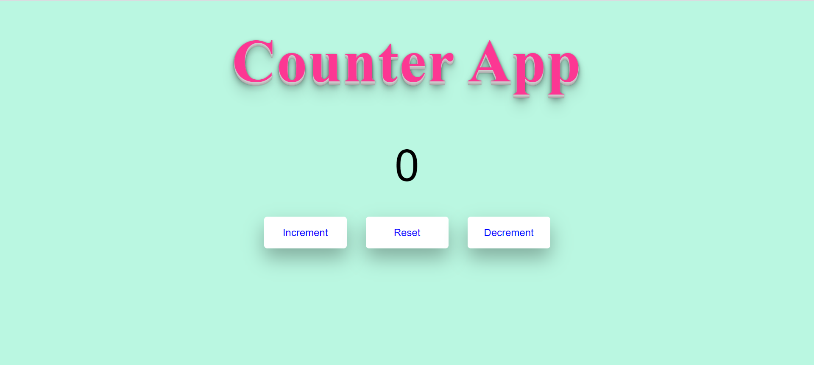

# Counter App

## About the Project
It is a simple Counter App.

When user clicks on <b><i>increment</i></b> button, current value will be incremented by 1.
When user clicks on <b><i>decrement</i></b> button, current value will be decremented by 1.
When user clicks on <b><i>reset</i></b> button, current value will be reset to 0.

## Tech Stacks Used

## Screenshots

## Visit Website

https://khushi-purwar.github.io/Developer-Days/Counter%20App/
